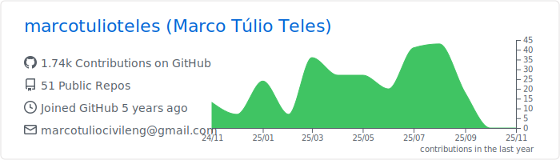
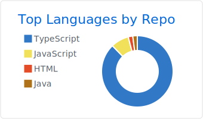

```


<h1> How's it going?! </h1>

### I'm a Civil Engineer and Front-End Developer passionate by techonlogy.

### Languages & Tools 🛠

&nbsp;

&nbsp;
&nbsp;

&nbsp;

&nbsp;
![Linux](https://img.shields.io/badge/-Linux-05122A?

<!-- <p align="left">
<a href="https://github.com/marcotulioteles">
  
  
</a>
</p> -->

<p align="left">
<a href="https://github.com/marcotulioteles">
  
  
</a>
</p>



<!-- <p align="center">
  
  
  
</p> -->

### Let's connect ? 🤝

<p align="left">
<a href="https://www.linkedin.com/in/marco-tulio-teles-30019672/"></a>
<a href="mailto:marcotuliocivileng@gmail.com"></a>
</p>
```
