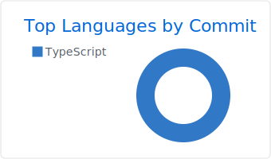

<h1> How's it going ?! </h1>

### I'm a Civil Engineer and Front-End Developer passionate about technology.

### Languages & Tools 🛠

&nbsp;&nbsp;&nbsp;&nbsp;&nbsp;&nbsp;&nbsp;
&nbsp;&nbsp;&nbsp;&nbsp;
&nbsp;&nbsp;&nbsp;

### Analytics ⚙️

<!-- 

 -->

<!-- 

  
  
  

 -->

### Let's connect ? 🤝

